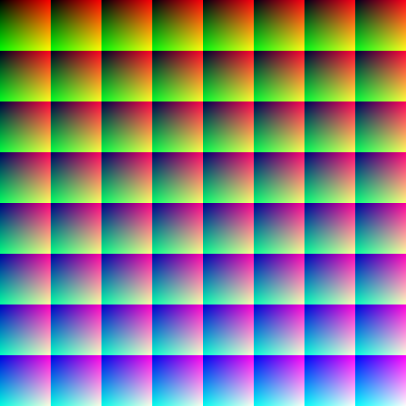
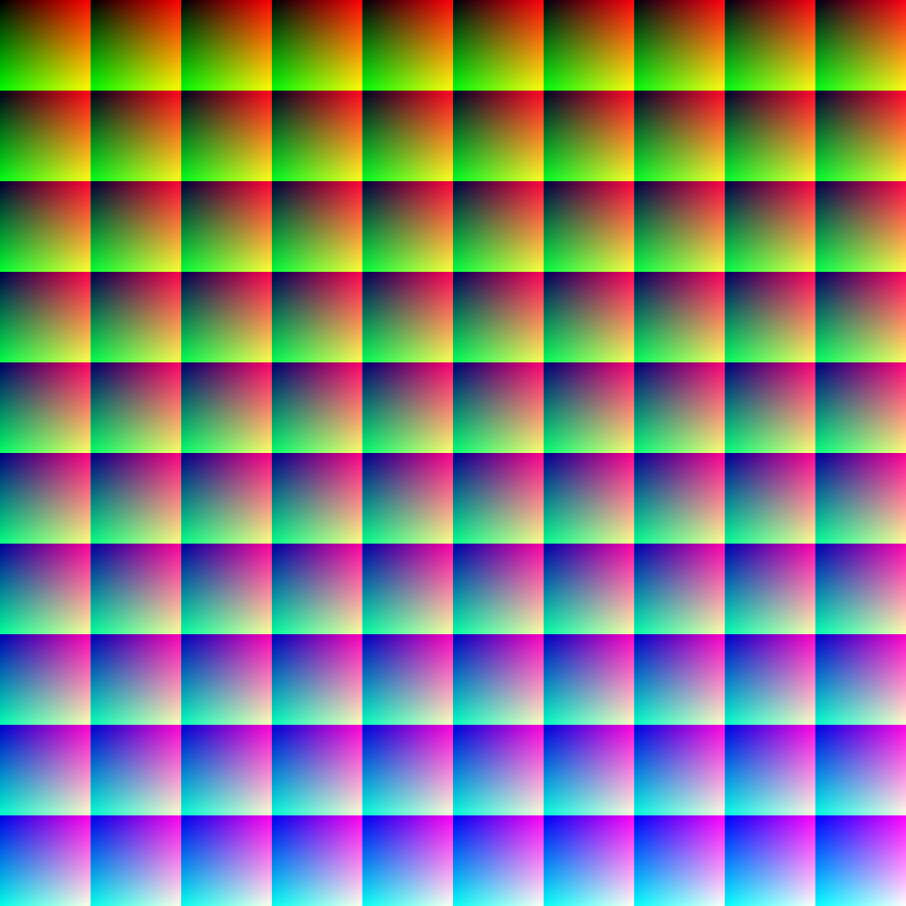

# Lut 2d square generator
Use to generate neutral LUT 2d square that you can customize the size.
Edit these lines in code if you want to customize.
```
CGSize size = CGSizeMake(512, 512); // Customize if need
```

```
CGFloat squareSize = 64; // Customize if need
```

You can use generated neutral LUT in here.

# 512x512:


# 1000x1000:
